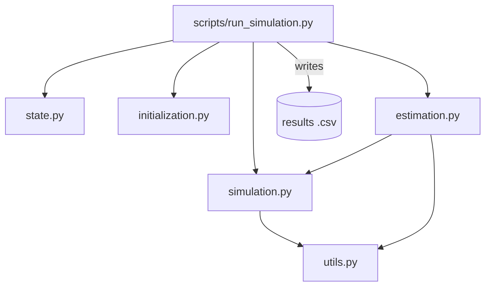

# DynamicCluster

Dynamic clustering of multivariate panel data using a Generalized
Autoregressive Score (GAS) filter driving a Hidden Markov Model (HMM)
style mixture model.

## Project goal

This project implements and studies a method for **dynamic clustering**:
grouping units in a multivariate panel data set into a small number of
clusters whose membership probabilities, means, and covariances evolve
over time rather than being fixed. Cluster assignment is driven by a GAS
filter, which uses the score of the observation density at each time
step to update the predicted means/covariances and, in turn, the
time-varying transition probabilities between clusters.

The current codebase is a research-style simulation study: it simulates
panel data under a known dynamic-clustering data-generating process,
estimates the model's parameters via maximum likelihood, and evaluates
how well the estimated clusters recover the true (simulated) cluster
structure. Results are written to disk as a `.csv` file.

**This repository has been restructured into a proper, reusable Python
package.** The model implementation now lives in the `dynamiccluster`
package, driven by a thin entry-point script; the sections below describe
this structure and will keep evolving as the package matures.

## Mathematical Framework

The model couples a Hidden Markov Model (HMM) style mixture model with Generalized Autoregressive Score (GAS) dynamics to track time-varying cluster structures in multivariate panel data $y_{i,t} \in \mathbb{R}^D$ for units $i = 1, \dots, N$ at times $t = 1, \dots, T$.

### 1. Mixture Model & HMM Transitions
Each unit $i$ belongs to a latent cluster $s_{i,t} \in \{1, \dots, K\}$. Conditional on cluster membership, the observations follow:
$$y_{i,t} \mid s_{i,t} = k \sim \mathcal{N}(\mu_{k,t}, \Sigma_{k,t})$$

The transition probabilities are driven by the distance **between cluster means**, not by any individual unit's own observation — the same transition matrix $\Pi_t$ applies to every unit, and a unit's own previous state $j$ only selects which row of $\Pi_t$ governs its next transition:
$$\pi_{t}^{(j \to k)} = P(s_{i,t} = k \mid s_{i,t-1} = j) = \frac{\exp(-\gamma \cdot d(\mu_{j,t-1}, \mu_{k,t-1}))}{\sum_{m=1}^K \exp(-\gamma \cdot d(\mu_{j,t-1}, \mu_{m,t-1}))}$$

where $d(\cdot)$ is a Mahalanobis distance between cluster means (using a covariance pooled/averaged across clusters), scaled by a sensitivity parameter $\gamma$.

### 2. GAS Update (Score-Driven Dynamics)
Instead of treating cluster parameters as static, the cluster means $\mu_{k,t}$ (mapped to a vector of time-varying parameters $f_{t}$) evolve over time. The updating mechanism is driven by the gradient of the log-likelihood (the score):

$$f_{t+1} = \omega + A s_t + B f_t$$

Where:
* $s_t = S_t \cdot \nabla_t$ is the scaled score step.
* $\nabla_t = \frac{\partial \ln p(y_t \mid f_t)}{\partial f_t}$ is the score vector (the first derivative of the log-likelihood of the mixture density at time $t$ with respect to the parameter vector $f_t$).
* $S_t$ is a scaling matrix (typically the inverse Fisher Information Matrix or the identity matrix).
* $\omega$, $A$, and $B$ are static coefficient matrices estimated via Maximum Likelihood Estimation (MLE).

**Current implementation note:** in `dynamiccluster/estimation.py`, only the cluster means $\mu_{k,t}$ are actually score-driven, with $\omega = 0$ and $B = I$ hardcoded (so the update reduces to $f_{t+1} = f_t + A\,s_t$, a single-parameter EWMA-style step, as noted in `run_hmm_gas_filter`'s docstring). The covariance's GAS coefficient is currently fixed to `0` in `extract_parameters`, so $\Sigma_{k,t}$ is **not** time-varying in practice — it stays at its k-means-initialized value for the whole run, despite being part of the general model above.
## Repository contents

| Path | Role |
|---|---|
| `dynamiccluster/` | The installable Python package containing the model implementation. |
| `dynamiccluster/state.py` | `SimulationState`, the container class holding simulated data, true/estimated parameters, and cluster probabilities. |
| `dynamiccluster/initialization.py` | Allocation of the time-varying parameter/data structures used throughout a simulation-estimation cycle (`initialize_time_varying_parameter_structure`, `initialize_simulation_matrices`). |
| `dynamiccluster/simulation.py` | Data-generating process: initial/updated cluster means for each simulation type, transition-probability generation, and `simulate_data`. |
| `dynamiccluster/estimation.py` | Maximum-likelihood estimation: parameter (re)parameterization, k-means initialization, the HMM/GAS filter recursion (`run_hmm_gas_filter`), and the `estimate_maximum_likelihood` driver. |
| `dynamiccluster/utils.py` | Generic numerical helpers (vectorization/half-vectorization of matrices, logit/logistic transforms) that are not specific to this method. |
| `scripts/run_simulation.py` | Entry point script. Defines simulation/estimation configuration ("magic numbers"), runs the simulation-estimation loop (optionally in parallel across simulations) using the `dynamiccluster` package, and writes results to a `.csv` file. |

## Dependency graph

- `scripts/run_simulation.py` imports `SimulationState` and
  `initialize_simulation_matrices` from the `dynamiccluster` package
  (re-exported via `dynamiccluster/__init__.py`), and imports directly
  from `dynamiccluster.simulation` and `dynamiccluster.estimation` for
  `simulate_data`/`estimate_maximum_likelihood` plus their parameter-dict
  key constants.
- `state.py` and `initialization.py` have no dependencies on the other
  `dynamiccluster` modules; they only build the plain data structures
  the rest of the package operates on.
- `simulation.py` implements the data-generating process (initial/updated
  cluster means, transition-probability generation, `simulate_data`) and
  depends on `utils.py` for vectorization helpers.
- `estimation.py` implements maximum-likelihood estimation, including the
  HMM/GAS filter recursion (`run_hmm_gas_filter`); it reuses the
  distance/transition-probability functions from `simulation.py` (
  `compute_cluster_distance_matrix`, `map_distances_to_transition_probabilities`)
  and the vectorization/logit helpers from `utils.py`.

## Running the code

From the repository root, run `python scripts/run_simulation.py` to
simulate data, estimate parameters, and write the results `.csv`.
Configure the simulation/estimation parameters at the top of
`scripts/run_simulation.py`, in particular:
- `random_seed`
- `n_simulations`
- `run_in_parallel` (default `False`; enables multi-core execution — leave
  `False` while exploring/debugging)
- `simulation_type`

## Notes on the GAS filter

To compute the likelihood of the HMM dynamic mixture model, the filter
proceeds as follows:

1. Start from initially predicted mixture probabilities, means, and
   variances for each mixture component, with `t = 1`.
2. Compute the likelihood contribution for time `t` and add it to the
   total likelihood.
3. Compute the transition probabilities from `t` to `t+1` using the
   means for time `t`.
4. Compute the score of the time-`t` density using the means and
   variances, and use the scores to update the means and covariances
   for time `t+1`.
5. Use the transition probabilities from step 3 to update the predicted
   probabilities to time `t+1`.
6. Increment `t` and repeat from step 2 until all time points are
   processed.

## Disclaimer

The software in this repository is provided "as is", without warranty of
any kind, express or implied, including but not limited to warranties of
merchantability, fitness for a particular purpose, and non-infringement.
Use at your own risk.
