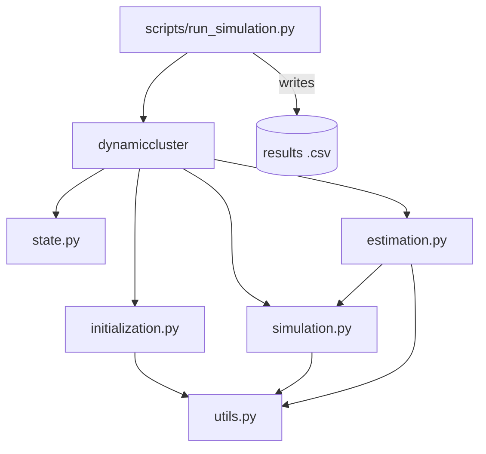
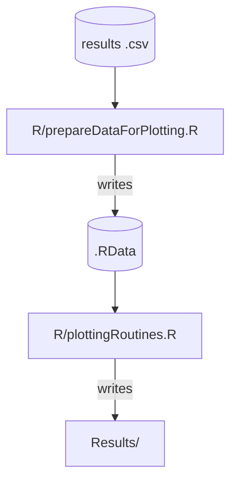

# DynamicCluster

Dynamic clustering of multivariate panel data using a Generalized
Autoregressive Score (GAS) filter driving a Hidden Markov Model (HMM)
style mixture model.

## Project goal

This project implements and studies a method for **dynamic clustering**:
grouping units in a multivariate panel data set into a small number of
clusters whose membership probabilities, means, and covariances evolve
over time rather than being fixed. Cluster assignment is driven by a GAS
filter, which uses the score of the observation density at each time
step to update the predicted means/covariances and, in turn, the
time-varying transition probabilities between clusters.

The current codebase is a research-style simulation study: it simulates
panel data under a known dynamic-clustering data-generating process,
estimates the model's parameters via maximum likelihood, and evaluates
how well the estimated clusters recover the true (simulated) cluster
structure. Results are written to disk and visualized separately.

**This repository is being restructured into a proper, reusable Python
package.** It has moved from a flat collection of scripts into a
`dynamiccluster` package plus a thin driver script; the sections below
describe this current structure and will keep evolving as the package
matures.

## Repository contents

| Path | Role |
|---|---|
| `dynamiccluster/` | The installable Python package containing the model implementation. |
| `dynamiccluster/state.py` | `SimulationState`, the container class holding simulated data, true/estimated parameters, and cluster probabilities. |
| `dynamiccluster/initialization.py` | Allocation of the time-varying parameter/data structures used throughout a simulation-estimation cycle (`initialize_time_varying_parameter_structure`, `initialize_simulation_matrices`). |
| `dynamiccluster/simulation.py` | Data-generating process: initial/updated cluster means for each simulation type, transition-probability generation, and `simulate_data`. |
| `dynamiccluster/estimation.py` | Maximum-likelihood estimation: parameter (re)parameterization, k-means initialization, the HMM/GAS filter recursion (`run_hmm_gas_filter`), and the `estimate_maximum_likelihood` driver. |
| `dynamiccluster/utils.py` | Generic numerical helpers (vectorization/half-vectorization of matrices, logit/logistic transforms) that are not specific to this method. |
| `scripts/run_simulation.py` | Entry point script. Defines simulation/estimation configuration ("magic numbers"), runs the simulation-estimation loop (optionally in parallel across simulations) using the `dynamiccluster` package, and writes results to a `.csv` file. |
| `R/prepareDataForPlotting.R` | Reads the simulation `.csv` output and processes it into an intermediate `.RData` object. |
| `R/plottingRoutines.R` | Reads the `.RData` object and produces the plots found in `Results/`. |
| `Results/` | Output directory for generated plots and result artifacts. |

## Dependency graph

### Python simulation/estimation pipeline

- `scripts/run_simulation.py` imports `SimulationState`,
  `initialize_simulation_matrices`, `simulate_data`, and
  `estimate_maximum_likelihood` from the `dynamiccluster` package
  (re-exported via `dynamiccluster/__init__.py`).
- `initialization.py` builds the time-varying parameter/data structures
  used by both simulation and estimation.
- `simulation.py` implements the data-generating process (initial/updated
  cluster means, transition-probability generation, `simulate_data`) and
  depends on `utils.py` for vectorization helpers.
- `estimation.py` implements maximum-likelihood estimation, including the
  HMM/GAS filter recursion (`run_hmm_gas_filter`); it reuses the
  distance/transition-probability functions from `simulation.py` and the
  vectorization/logit helpers from `utils.py`.

### R post-processing/plotting pipeline

- `R/prepareDataForPlotting.R` reads the `.csv` produced by
  `scripts/run_simulation.py` and saves an intermediate `.RData` object.
- `R/plottingRoutines.R` reads that `.RData` object and generates the
  plots saved under `Results/`.

## Running the code

1. From the repository root, run `python scripts/run_simulation.py` to
   simulate data, estimate parameters, and write the results `.csv`.
   Configure the simulation/estimation parameters at the top of
   `scripts/run_simulation.py`, in particular:
   - `random_seed`
   - `n_simulations`
   - `run_in_parallel` (default `False`; enables multi-core execution — leave
     `False` while exploring/debugging)
   - `simulation_type`
2. Run `R/prepareDataForPlotting.R` followed by `R/plottingRoutines.R` to
   process and visualize the results.

## Notes on the GAS filter

To compute the likelihood of the HMM dynamic mixture model, the filter
proceeds as follows:

1. Start from initially predicted mixture probabilities, means, and
   variances for each mixture component, with `t = 1`.
2. Compute the likelihood contribution for time `t` and add it to the
   total likelihood.
3. Compute the transition probabilities from `t` to `t+1` using the
   means for time `t`.
4. Compute the score of the time-`t` density using the means and
   variances, and use the scores to update the means and covariances
   for time `t+1`.
5. Use the transition probabilities from step 3 to update the predicted
   probabilities to time `t+1`.
6. Increment `t` and repeat from step 2 until all time points are
   processed.

## Disclaimer

The software in this repository is provided "as is", without warranty of
any kind, express or implied, including but not limited to warranties of
merchantability, fitness for a particular purpose, and non-infringement.
Use at your own risk.
